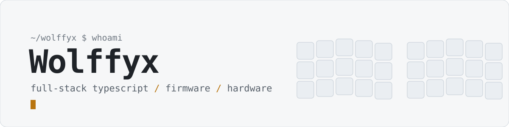

  <picture>
    <source media="(prefers-reduced-motion: reduce) and (prefers-color-scheme: dark)" srcset="./assets/header-dark-static.svg" />
    <source media="(prefers-reduced-motion: reduce)" srcset="./assets/header-light-static.svg" />
    <source media="(prefers-color-scheme: dark)" srcset="./assets/header-dark.svg" />
    
  </picture>

  
  
  

## About

Engineer working across the whole stack — from the interface down to the hardware underneath. I like systems I can understand end to end.

Open to collaborations and interesting problems — reach out on [LinkedIn](https://linkedin.com/in/lupu-marius-gabriel-96494559).

## Featured

<table>
  <tr>
    <td valign="top">
      <h3><a href="https://github.com/Wolffyx/remappr">Remappr</a></h3>
      
Universal device manager — one app to connect, remap, light up and build your devices across firmwares. Supports ZMK, QMK, VIA, Vial and Keychron today, with a pluggable adapter architecture for more.

      
<a href="https://docs.remappr.com">docs.remappr.com</a>

    </td>
  </tr>
</table>

## Stack

<table>
  <tr>
    <td><b>Languages</b></td>
    <td>
      
      
      
      
      
      
      
      
      
    </td>
  </tr>
  <tr>
    <td><b>Frontend</b></td>
    <td>
      
      
      
      
      
      
      
      
      
    </td>
  </tr>
  <tr>
    <td><b>Backend</b></td>
    <td>
      
      
      
      
      
      
      
      
    </td>
  </tr>
  <tr>
    <td><b>Data</b></td>
    <td>
      
      
      
      
      
      
    </td>
  </tr>
  <tr>
    <td><b>Infra</b></td>
    <td>
      
      
      
      
      
      
      
      
    </td>
  </tr>
  <tr>
    <td><b>Tooling</b></td>
    <td>
      
      
      
      
      
      
      
      
      
      
      
    </td>
  </tr>
  <tr>
    <td><b>Other</b></td>
    <td>
      
      
      
    </td>
  </tr>
</table>

## Activity

  
  

  

  <picture>
    <source media="(prefers-color-scheme: dark)" srcset="https://raw.githubusercontent.com/Wolffyx/wolffyx/output/github-snake-dark.svg" />
    <source media="(prefers-color-scheme: light)" srcset="https://raw.githubusercontent.com/Wolffyx/wolffyx/output/github-snake.svg" />
    
  </picture>

## Support

If something here saved you time:

<!--  -->

